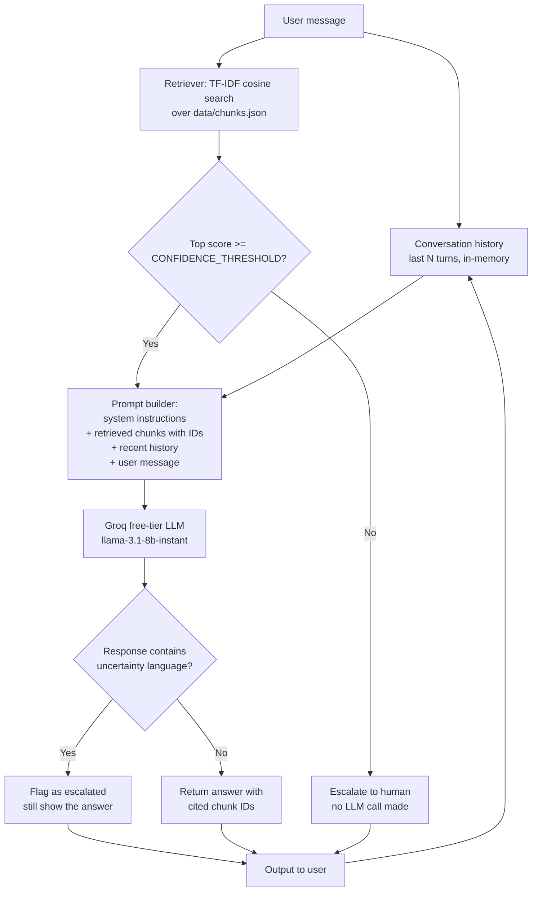
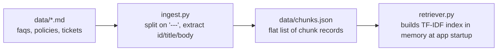

# System Design

## End-to-end query flow

## Offline step (run once, or whenever source data changes)

## Component responsibilities

- **ingest.py** — one-time (or on-data-change) parse of the raw markdown into structured chunk records (see `SCHEMA.md`). Pure text processing, no network, no dependencies.
- **retriever.py** — in-memory TF-IDF index + cosine-similarity search over chunks. No embedding API, no vector DB, no network call. This is the component that would change first if the corpus grew (see "Trade-offs" in `README.md`).
- **llm_client.py** — thin HTTP wrapper around Groq's free-tier chat completion endpoint. Isolated in its own module so swapping providers (Gemini, OpenRouter) only touches this file.
- **app.py** — orchestration: retrieve → confidence gate → prompt build → generate → escalation check → conversation history. This is also where the two escalation checks (pre-LLM retrieval confidence, post-LLM uncertainty language) live.
- **eval/** — `eval_set.json` (labeled queries) + `run_eval.py` (automated retrieval hit-rate check). See README "Eval plan" for the parts of evaluation that aren't automated here (answer correctness, hallucination rate) and how they'd be measured.

## Why this shape

The whole system is intentionally **retrieval-gated**: the LLM is only ever called when retrieval already found something plausibly relevant (`top_score >= CONFIDENCE_THRESHOLD`). This is the main anti-hallucination mechanism — rather than always calling the LLM and hoping it says "I don't know" when the context is irrelevant, the irrelevant case is caught *before* generation, deterministically, for free (no API call, no latency, no cost). The second, softer check (scanning the LLM's own reply for uncertainty language) exists because retrieval confidence and answer confidence aren't the same thing — retrieval can find a *plausible* but ultimately insufficient chunk, and the LLM itself may still (correctly) say "I'm not sure." Neither check alone is sufficient; see README "Trade-offs" for the more robust alternatives (a judge model, logprob-based confidence, human-labeled calibration) a production version would use instead.
